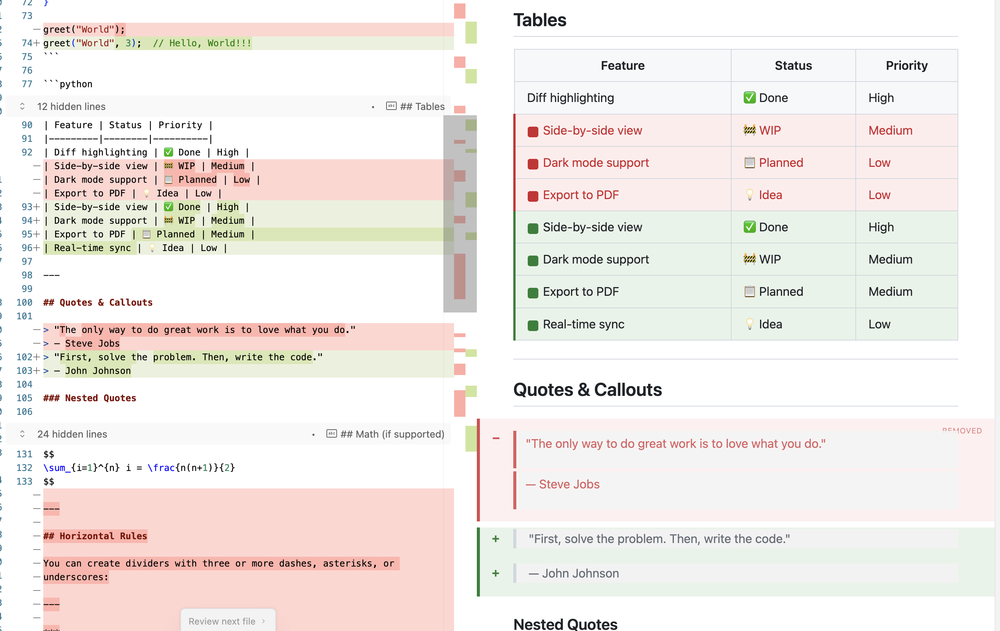

# Markdown Diff Preview

A VS Code extension that shows a beautiful Markdown preview with **git diff highlighting** inline. See exactly what changed in your documentation at a glance.

## Features

- **Live Markdown Preview** — Real-time rendering as you type
- **Added Lines** — Highlighted with a green background and `+` indicator
- **Removed Lines** — Shown in context with red highlighting and `−` indicator
- **Auto-refresh** — Updates when the document or git state changes
- **Dark Theme** — Beautiful GitHub-inspired dark mode design
- **Click to Navigate** — Click on diff lines to jump to that line in the editor

## Installation

### From VS Code Marketplace

1. Open VS Code
2. Press `Ctrl+P` / `Cmd+P`
3. Type `ext install YOUR_PUBLISHER_NAME.markdown-diff-preview`
4. Press Enter

Or search for "Markdown Diff Preview" in the Extensions sidebar.

### From VSIX

1. Download the `.vsix` file from [Releases](https://github.com/YOUR_USERNAME/markdown-diff-preview/releases)
2. Open VS Code
3. Go to Extensions → `...` menu → "Install from VSIX..."
4. Select the downloaded file

## Usage

1. Open any Markdown file in a git repository
2. Press `Cmd+Shift+V` (Mac) or `Ctrl+Shift+V` (Windows/Linux)
3. Or click the preview icon in the editor title bar
4. Or run command: **"Open Markdown Diff Preview"**

The preview will show your rendered Markdown with:
- 🟢 **Green highlights** for lines you've added
- 🔴 **Red highlights** for lines you've removed

## Configuration

| Setting | Default | Description |
|---------|---------|-------------|
| `markdownDiffPreview.diffBase` | `HEAD` | Git ref to compare against (e.g., `HEAD`, `main`, `origin/main`) |
| `markdownDiffPreview.showLineNumbers` | `true` | Show line numbers on hover |
| `markdownDiffPreview.highlightStyle` | `both` | How to display diff highlights: `inline`, `gutter`, or `both` |

## How It Works

1. **Git Integration** — Uses `git diff` to detect changes between the current file and a configurable base ref
2. **Line Mapping** — Maps diff hunks to line numbers in the current file
3. **Markdown Parsing** — Renders Markdown with inline diff annotations
4. **Webview Panel** — Displays the preview in a side panel with custom styling

## Requirements

- VS Code 1.85.0 or higher
- Git installed and available in PATH
- File must be in a git repository to see diff highlighting

## Contributing

Contributions are welcome! Please feel free to submit a [Pull Request](https://github.com/YOUR_USERNAME/markdown-diff-preview/pulls).

## License

[MIT](LICENSE) © Your Name
